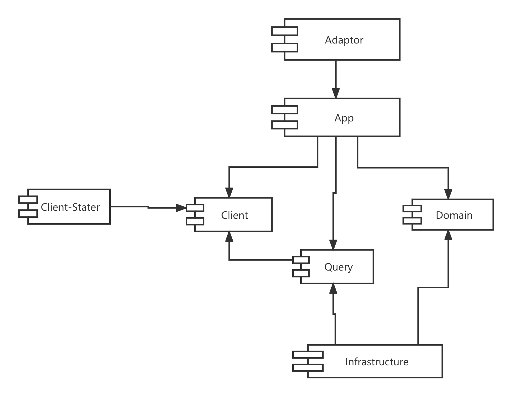

# Some awesome components based on Cola

## Overview
本项目旨在依托DDD探索一条简便的开发之路，所以这里DDD是 Domain Drive Development, 而非 Domain Drive Design.
## 核心组件
1. core-adapter

    未实现
1. core-app 

    对AppService、CmdExecutor、CmdProcessor概念进行封装
2. core-domain

    对 BaseAggregateRoot、BaseE、Gateway等盖帘进行封装
3. core-infr

    对 BaseGatewayImpl进行实现，实现了自动转换、自动充血、自动持久化等功能
4. core-exception

    对 业务异常进行了封装，实现了基本异常的处理器。
## 增强组件
- dictionary
    摆脱枚举转换的烦恼
    
- mock
    在接口完成开发之前，提供mock数据给前端
    
- office
    优雅地进行导入导出
    
- distributed
    分布式锁、限流、防重、幂等等工具能力
    
- utils
    自己封装的工具类，及基于Hutool的工具类增强

- framework-archetype
    项目模板 （ 未实现 ）
## 开发规范

### Adapter 层
1. Adapter 层要维护Application所需的登录、权限等信息。
2. Adapter 层原则上使用 Form、VO与外部交互，不要为了重用而调整Cmd或Qry对象。

3. Controller 命名为 XxControllerForApp、XxControllerForOpenApi
4. 请求适配器命名为 XxRequestAdapter 如 PlaceOrderRequestAdapter

### Application 层
1. Application目的是做编排、控制及应用层面内聚。
2. 不能直接依赖Infrastructure。
3. 追求无状态，避免利用TreadLocal或RequestAttributes传递值，这样会导致控制耦合。
4. 不要使用Context对象，公共耦合。

5. AppService 命名为 XxAppService 
6. Executor、Processor 统一命名为 XxCmdExecutor，并实现 ICmdExecutor或 ICmdProcessor, 且加上@CmdExecutor注解
7. 事务统一加载 AppService 方法上。
8. 请注意，CmdExecutor 会自动对 Cmd 做校验。
9. EventListener 统一命名为XxEventListener

### Domain 层
1. Domain 层的目的是知识内聚，要屏蔽实现细节，聚焦于核心概念的表述。
2. Domain 层不能直接依赖Infrastructure。
3. Domain 层需要确保领域知识的完整性：非同一聚合的不能相互调用，同一聚合的不能分开；核心知识必须封装到Domain层。
4. 聚合根默认作为单例Bean存在，可以注入Gateway进行操作，但禁止在本聚合内直接操作其他聚合的数据。
5. 创建聚合根的逻辑建议使用DomainFactory封装，DomainFactory本身是一种DomainService。
6. 需要操作、查询、校验多个聚合跟（而非明确的某一个）时，使用DomainService。
7. 属于本聚合固有行为，且该行为可能引发其他聚合改变的，可以用DomainEvent。
8. 发布事件需要在调用聚合根的Save方法后。
9. 领域事件必须在Domain层内发布，不能在Application层发布。

10. AggregateRoot、DomainEntity 统一命名为 XxE
11. 领域事件统一命名为 XxEvent。

### Infrastructure 层
1. Infrastructure层的目的是技术实现、资源调配，对上层透明，通过Gateway与Domain、Application交互。
2. Gateway只设计于服务相应的聚合，Gateway实现不宜有太多业务逻辑。
3. 出SpringDataRepository 外，建议把外部服务（FeiClient等) 通过RepositoryWrapper包装为一个整体。 缓存也建议加在Repository上。
4. MyBatis Mapper 命名空间 优先按逻辑概念聚合。
5. DO( Data Object) 及 Entity只宜出现在本层。
6. 事件、消息的实现在本层，但处理通常在App层。
7. 事务型操作建议使用Jpa、查询操作建议使用MyBatis，且禁止同一事务中用Jpa和MyBatis同时写，会导致很多缓存失效，进而导致数据不一致。

8. Gateway 命名为 XxGateway
9. Mapper 命名为 XxAggregationMapper
10. 对实体转换的 Converter 统一命名为 XxEntityConverter
11. 利用 MapperConfig封装共用的Convert逻辑

## 版本说明
### 1.0.3 
1. 自动装配 DataFiller
2. 领域实体 Payload
3. Excel 导出优化
....

### 1.0.5 
1. 执行器CmdExecutor 统一参数校验 @Valid
2. Dictionary 默认扫包路径
3. 反射处理DomainPayloadCopy
4. 优化及修复CoreExceptionHandler
5. 请求级别缓存实现 RequestContextCacheManager

### 1.0.6 (孵化中)
1. Gateway增加remove方法；
2. Gateway增加发布事件忽略异常方法
3. LocalDateTimeToLongConverter、LocalDateToLongConverter
4. 优化统一异常处理；
5. SetUtil (Hutool的 CollUtil是基于Collection进行交集、并集、差集运算，不能满足侠义上的集合运算)
6. WithEntityPayloadConverter 隐藏Payload概念，降低使用成本。
7. RequestScopeCacheSweeper 自动配置
8. EntityConverter 基于IJpaEntity转换，IJpaEntity移除非必要参数（仅保留Id)
9. Dictionary 去除对MyBatis-Plus、Hibernate强依赖；只需要配置Dictionary扫包路径，不需再配置MyBatis-plus枚举扫包路径。

### 1.1 (孵化中)
1. 去掉Payload 从 EntityManager 中获取JpaEntity对象
2. Fix: Dictionary MyBatisTypeHandler注册 bug.
3. 干掉非通用性工具。

### TODO LIST
1. enhanced-auditing 组件封装
2. multi-tenancy-jpa 组件封装

~~3. LocalDateTimeToLongConverter、LocalDateToLongConverter~~

4. archetype
5. Excel 导入导出
6. PDF 处理
7. MQ 整合Event
8. 想办法干掉Payload
9. repository 大量数据异步请求
10. 业务日志框架
11. 多租户
12. 因为version 领域不能多次Save的问题(可以用AOP主动Save后发event，保证只调一次Save)